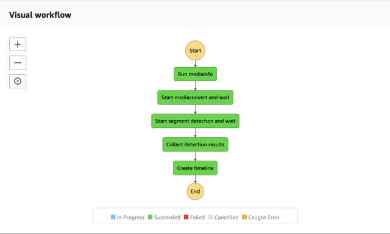
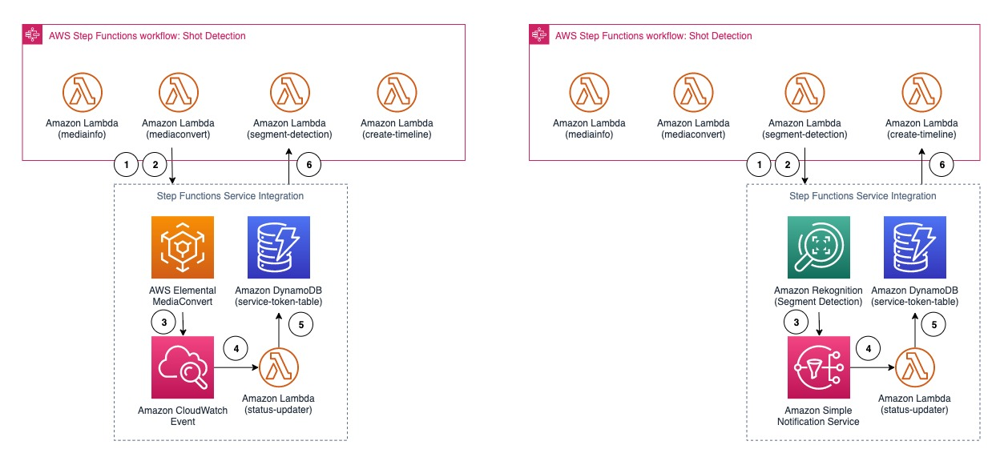
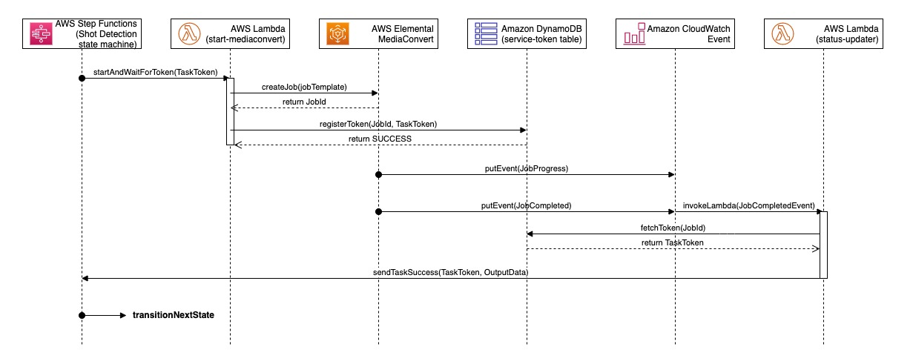
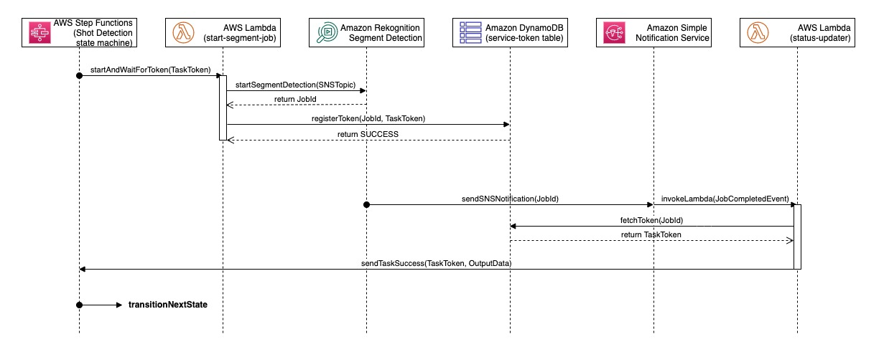

# Shot Detection State Machine

## Overview

The Shot Detection State Machine uses [AWS Step Functions](https://aws.amazon.com/step-functions/) to orchestrate the detection workflow where it runs Mediainfo to extract technical metadata of the video, creates a proxy video (MP4 960x540) based on the mediainfo, runs Amazon Rekognition Segment API to extract the shots and technical cues metadata from the video, and parses and converts the metadata to create WebVTT tracks (for display) and Edit Decision List (EDL) file for editing software.

The diagram shows the shot detection state machine.



The state machine also uses numbers of optimization techniques (will be discussed later) including [AWS Step Function Service Integration](https://docs.aws.amazon.com/step-functions/latest/dg/connect-to-resource.html) and [Amazon DynamoDB Time To Live (TTL)](https://docs.aws.amazon.com/amazondynamodb/latest/developerguide/TTL.html).

The diagram illustrates the Service Integration technique.



___

## State: Mediainfo

Running mediainfo allows us to extract the technical information of the video file. It is particularly useful if the uploaded video is MXF format which tends to contain many tracks. For example, MXF file can contain one video track and 16 mono PCM audio tracks. The mediainfo helps the solution to find the combination of tracks to use when creating the proxy video.

__

## State: MediaConvert

The MediaConvert state converts the uploaded video into a standardized MP4 output format.

Creating a proxy video allows the solution to support a wider range of video formats. Please check [AWS Elemental MediaConvert Supported Input Codecs and Containers](https://docs.aws.amazon.com/mediaconvert/latest/ug/reference-codecs-containers-input.html) for more details. 

The standardized proxy MP4 output can also be used for streaming and download.

The MP4 output format is as follows:

| Name | Description |
|:-----|:------------|
| Resolution | 960x540 |
| Container | QuickTime |
| Video Encode | H.264@2Mbps, High Profile, [QVBR](https://aws.amazon.com/media/tech/quality-defined-variable-bitrate-qvbr/) |
| Framerate | Follow input |
| GOP | 2 seconds |
| Audio Encode | AAC@96Kbp@48kHz |

In this state, the lambda function creates and starts a transcoding job with AWS Elemental MediaConvert and exits the state.

At this point, the state machine execution is paused and waiting for an external signal (task token) to resume to the next state. This is the AWS Step Functions Service Integration feature that will be covered later on.

__

## State: Segment Detection

The Segment Detection state takes the proxy video from the previous state and runs the segment detection by calling Amazon Rekognition Segment API and then pauses the state machine. It resumes when the segment detection job completes.

The segment detection result contains timecode (drop frame and non-drop frame), the type of the detections, and confidence scores, see below:

```json
{
  "Segments": [
    {
      "DurationMillis": 6334,
      "DurationSMPTE": "00:00:06:08",
      "EndTimecodeSMPTE": "00:00:07:21",
      "EndTimestampMillis": 7875,
      "StartTimecodeSMPTE": "00:00:01:13",
      "StartTimestampMillis": 1541,
      "TechnicalCueSegment": {
        "Confidence": 96.01,
        "Type": "EndCredits"
      },
      "Type": "TECHNICAL_CUE"
    },
    {
      "DurationMillis": 8875,
      "DurationSMPTE": "00:00:08:21",
      "EndTimecodeSMPTE": "00:00:08:21",
      "EndTimestampMillis": 8875,
      "ShotSegment": {
        "Confidence": 99.89057159423828,
        "Index": 0
      },
      "StartTimecodeSMPTE": "00:00:00:00",
      "StartTimestampMillis": 0,
      "Type": "SHOT"
    },
    ...
  ]
}

```

__

## State: Collect Detection Results

The Collect Detection Results state simply collects the Segment detection JSON results and store them into the Amazon S3 source bucket.

__

## State: Timeline Creation

The Timeline Creation state uses the shots and technical cues metadata returned by Amazon Rekognition Segment API and converts them into two formats: WebVTT and EDL. The WebVTT file is used for overlaying the detection results on video. The EDL file can be downloaded and imported to editing software (BlackMagic Davinci Resolve 16, Adobe Premerie Pro, and so forth) as a timeline.


___

## AWS Step Functions Service Integration Technique

As mentioned earlier, the Shot Detection state machine uses AWS Step Functions Service Integration technique to simplify the workflow. This is very useful when you have an asynchronous process that requires long wait and constantly monitoring the status of the process.

A typical way of implementing a state machine that involves a long-wait process is to provide a polling loop where it **sleeps**, **wakes up every X seconds**, **checks the status** and **goes back to sleep** until the process completes.

With the Service Integration, we eliminate the polling or loop. Instead, we start the long-wait process, pause the execution until the process is completed and notify the state machine. Then, the state machine resumes to the next state.

This makes the state machine much simplier to read and to maintain. It is also cost optimized as we eliminate unnecessary state transitions.

In the Shot Detection state machine, **mediaconvert** and **segment detection** states use this Service Integration technique.

Let's dive deep into both states.

### Call Flow of Starting and Waiting a MediaConvert (Transcoding) process



1) The state language to start and wait a state is slightly different. Instead of specify the lambda ARN, we specify the Resource as **arn:aws:states:::lambda:invoke.waitForTaskToken** 

```json
{
    "Start mediaconvert and wait": {
        "Type": "Task",
        "Resource":"arn:aws:states:::lambda:invoke.waitForTaskToken",
        "Parameters": {
            "FunctionName": "ml9801-<guid>-shot-detection",
            "Payload": {
                "token.$":"$$.Task.Token",
                "state": "start-mediaconvert",
                "input.$": "$.input",
                "output.$": "$.output"
            }
        },
        "TimeoutSeconds": 10800,
        "Next": "Start segment detection and wait"
    },

}
```
This allows the state machine to pass in a **taskToken** parameter which is used by a lambda function, **status-updater** to send task result back to the state machine.

2) start-mediaconvert lambda function calls CreateJob to submit a transcoding request to AWS Elemental MediaConvert. The response contains a JobId. The lambda function uses the JobId as a partition key to store the **taskToke** and the current state data to an Amazon DynamoDB table.

3) AWS Elemental MediaConvert periodically sends events to Amazon CloudWatch Event where an Amazon CloudWatch Event Rule is configured to listen to **MediaConvert Job State Change** and triggers a **status-updater** lambda function when a transcode job is completed or errored.

```json
{
  "detail-type": [
    "MediaConvert Job State Change"
  ],
  "source": [
    "aws.mediaconvert"
  ],
  "detail": {
    "userMetadata": {
      "solutionUuid": [
        "31ee4790-ab34-11ea-ad09-<guid>"
      ]
    },
    "status": [
      "COMPLETE",
      "CANCELED",
      "ERROR"
    ]
  }
}

```

_(Note: userMetadata.solutionUuid is used to make sure the status-updater lambda function is triggered only when the MediaConvert Job is created by this solution.)_

4) The status-update lambda fetches the **taskToken** from the Amazon DynamoDB table and sends the task result back to the state machine

5) The state machine receives the task result and transitions to the next state (or terminates the execution if the task fails).


### Call Flow of Starting and Waiting Segment detection with Amazon Rekognition process



Similar to the Call Flow earlier, the only difference is that Amazon Rekognition uses [Amazon Simple Notification Service (SNS)](https://aws.amazon.com/sns/) to communicate the job status instead of Amazon CloudWatch Event.

The rest of the call flow is identical.

___

## Amazon DynamoDB Time To Live (TTL) Technique

[Amazon DynamoDB Time To Live (TTL)](https://docs.aws.amazon.com/amazondynamodb/latest/developerguide/TTL.html) allows you to define a per-item timestamp to determine when an item is no longer needed. This is useful in scenarios where the data is temporary and short-live. In this demo, we use Amazon DynamoDB table to temporarily store the **task token** used to communicate back to the AWS Step Functions state machine. It is a good fit to configure the data items to expire after certain time.

The diagram shows table items and attributes of two different states of the shot detection state machine.


The **ttl** attribute of each newly created item is set to expire after 1 day.

| Name | Description |
|:-----|:------------|
| id | Partition Key, JobId of AWS Elemental MediaConvert or Amazon Rekognition Segment Detection |
| keyword | Sort Key. Not used in this demo but is useful to perform searching, sorting, and filtering |
| api | name of the execution state |
| data | input data of the current execution state. This information is passed back to the next state of the state machine  |
| service | identifies the service name |
| token | task token, used to identify a specific state of a state machine execution. It is used to communicate the task result back to the state machine |
ttl (TTL) | time to expire the item |

(A side note: if you need to track every transaction of the process, you can still use **TTL**. You could then use [Amazon DynamoDB Stream](https://docs.aws.amazon.com/amazondynamodb/latest/developerguide/Streams.html) to capture activities of the table and store changes to your S3 bucket.)

___

## Navigating the code structure

The code is structured as **states/\<state-name\>/**.

| Name | Description |
|:-----|:------------|
| source/step/shared/ | shared component among states |
| source/step/states/run-mediainfo/ | a state to run mediainfo |
| source/step/states/start-mediaconvert/ | a service integration state to start an AWS Elemental MediaConvert job |
| source/step/states/start-segment-detection/ | a service integration state to start Amazon Rekognition Segment Detection job |
| source/step/states/collect-detection-results/ | a state to collect Amazon Rekognition Segment results and store the raw JSON result to an Amazon S3 **source** bucket |
| source/step/states/create-timeline/ | a state to convert the segment JSON result into WebVTT tracks and Edit Decision List (EDL) file |

The state machine lambda function also uses an AWS Lambda Layer, core-lib which contains a common utility class, state definition that are shared by different lambda functions such as the api, status-updater, custom-resources, and the step function lambda functions.

| Name | Description |
|:-----|:------------|
| source/layers/core-lib/ | shared component across different lambda functions |

___

## Navigating File Structure in Amazon S3 Source Bucket

The state machine stores state output to the Amazon S3 **source** bucket.

| Location | Description |
|:---------|:------------|
| s3://\<src-bucket\>/\<basename\>/run-mediainfo/mediainfo.json | Mediainfo of the uploaded video in JSON format |
| s3://\<src-bucket\>/\<basename\>/start-mediaconvert/ | MP4 Proxy video and JPEG thumbnails generated by AWS Elemental MediaConvert |
| s3://\<src-bucket\>/\<basename\>/collect-detection-results/00000000.json | Raw JSON results from Amazon Rekognition Segment Detection. If you have long hours video, you would have multiple JSON files numbered as 00000000.json, 00000001.json, and so forth |
| s3://\<src-bucket\>/\<basename\>/create-timeline/ | stores EDL file and WebVTT (.vtt) files |

___

## Security

The permission of the state machine and the state lambda functions are govened by two IAM Roles; one for the state machine and another for the state lambda function.


### IAM Role of the State Machine
The State Machine is given permission to **invoke** specific lambda functions.

```json
{
    "Version": "2012-10-17",
    "Statement": [
        {
            "Action": "lambda:InvokeFunction",
            "Resource": "arn:aws:lambda:<region>:<account>:function:ml9801-<guid>-*",
            "Effect": "Allow"
        }
    ]
}

```

__

### IAM Role of the State Lambda Functions
The state lambda function is given permission to access the **Amazon S3** source bucket, start and describe **AWS Elemental MediaConvert** job, accesses to a specific **Amazon DynamoDB** service token table, and to start and get **Amazon Rekognition Segment Detection** job.

```json
{
    "Version": "2012-10-17",
    "Statement": [
        {
            "Action": "s3:ListBucket",
            "Resource": "arn:aws:s3::<source-bucket>",
            "Effect": "Allow"
        },
        {
            "Action": [
                "s3:GetObject",
                "s3:PutObject",
                "s3:SelectObjectContent"
            ],
            "Resource": "arn:aws:s3::<source-bucket>/*",
            "Effect": "Allow"
        },
        {
            "Action": [
                "mediaConvert:DescribeEndpoints",
                "mediaConvert:CreateJob",
                "mediaConvert:GetJob"
            ],
            "Resource": [
                "arn:aws:mediaconvert:<region>:<account>:*"
            ],
            "Effect": "Allow"
        },
        {
            "Action": [
                "iam:GetRole",
                "iam:PassRole"
            ],
            "Resource": "arn:aws:iam::<account>:role/<mediaconvert-role>",
            "Effect": "Allow"
        },
        {
            "Action": [
                "logs:CreateLogGroup",
                "logs:CreateLogStream",
                "logs:PutLogEvents"
            ],
            "Resource": "arn:aws:logs:<region>:<account>:log-group:/aws/lambda/*",
            "Effect": "Allow"
        },
        {
            "Action": [
                "dynamodb:DeleteItem",
                "dynamodb:DescribeTable",
                "dynamodb:Query",
                "dynamodb:Scan",
                "dynamodb:UpdateItem",
                "dynamodb:Attributes",
                "dynamodb:LeadingKeys",
                "dynamodb:ReturnConsumedCapacity",
                "dynamodb:ReturnValues",
                "dynamodb:Select"
            ],
            "Resource": "arn:aws:dynamodb:<region>:<account>:table/ml9801-<guid>-*",
            "Effect": "Allow"
        },
        {
            "Action": [
                "rekognition:StartSegmentDetection",
                "rekognition:GetSegmentDetection"
            ],
            "Resource": "*",
            "Effect": "Allow"
        },
        {
            "Action": "iam:PassRole",
            "Resource": "arn:aws:iam::<account>:role/<sns-topic-role>",
            "Effect": "Allow"
        }
    ]
}

```

___

Next to [Webapp Component](../webapp/README.md) | Back to [RESTful API Component](../api/README.md) | Return to [README](../../README.md)

